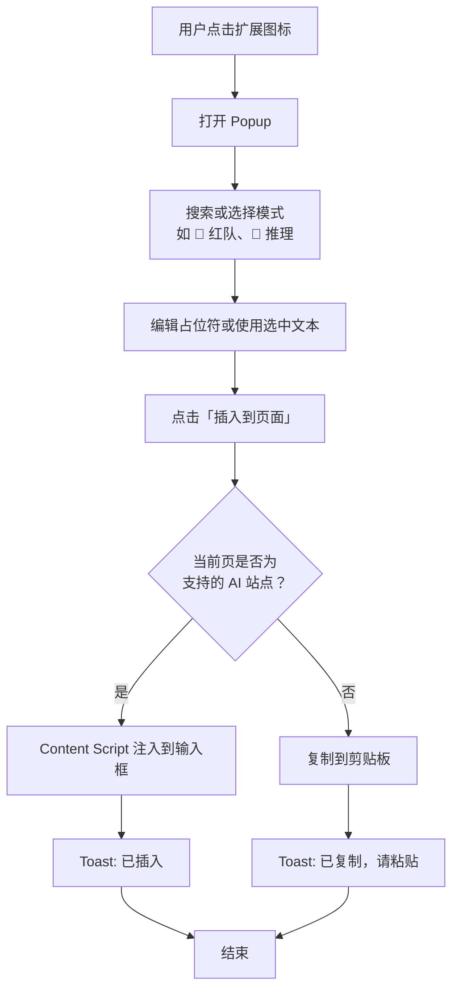
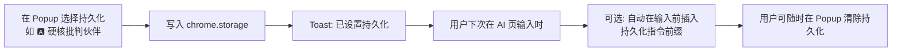
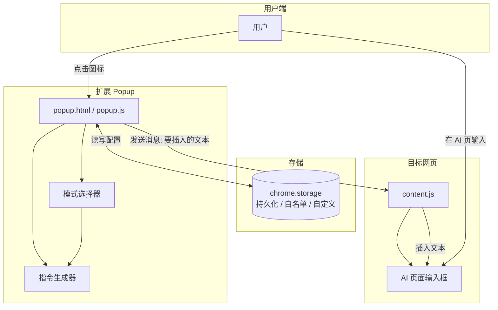
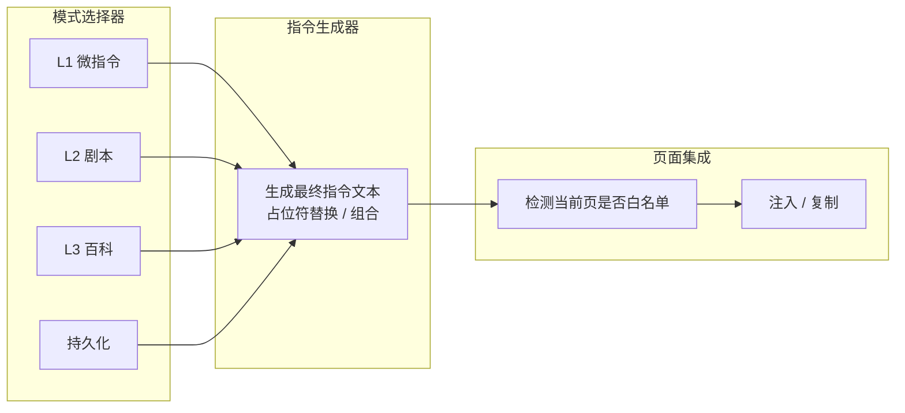

# ThinkPrism 开源原型设计文档

> 基于《AI 思维模式激活指令手册 (Lyra Edition · V3.0)》的 Chrome 插件开源产品原型说明。  
> 文档版本：**V1.1 (开源版)** | 更新日期：2026-03-03

---

## 文档目录

| 章节 | 内容 |
|------|------|
| 一 | 产品概述（定位、用户、特性、差异化） |
| 二 | 功能设计（模块、功能清单、思维模式使用场景、**推荐引擎与执行反馈**、站点配置、流程图、新用户引导、模式组合规则、边界与异常、数据与版本） |
| 三 | UI/UX 设计要点（含错误文案、**交互细节**） |
| 四 | 技术实现要点（含性能与**冷启动**目标、开源实践） |
| 五 | MVP vs Nice-to-have 拆分 |
| 六 | 隐私与权限声明 |
| 七 | 版本迭代规划 |
| 八 | 开源与社区待办（含贡献指南） |
| 九 | 上架合规与风险（含审核演示脚本、站点维护计划、**行为边界声明**） |

---

## 一、产品概述

### 1.1 产品定位

**ThinkPrism** 是一款开源的 Google Chrome 浏览器插件，用于在与 AI（如 ChatGPT、Claude、DeepSeek、通义千问、豆包、Grok 等）对话时，快速激活《AI 思维模式激活指令手册》中的思维模式，提升对话质量与深度。

**核心价值**：将手册中的多层级指令（微指令、黄金剧本、百科模式、持久化设定）转化为「热键式」操作，减少复制粘贴与记忆负担，实现对话中无缝切换思维模式。作为开源项目，鼓励社区贡献新模式、站点适配和功能扩展。

### 1.2 目标用户

| 用户类型         | 典型场景                     | 核心诉求                     |
|------------------|------------------------------|------------------------------|
| 开发者           | 代码审查、架构讨论、调试     | 快速调用红队/架构/推理       |
| 产品/项目经理    | 需求评审、方案打磨、决策     | 产品打磨器、决策罗盘         |
| 战略/决策者      | 战略推演、情景规划           | 二阶效应、情景规划           |
| 学习者           | 费曼讲解、知识图谱、错题诊断 | 学习加速器、百科模式         |

手册中特别提到的 **BatchRemove 项目开发者** 可作为种子用户，重点支持「硬核批判伙伴」「产品打磨器」「代码堡垒」等场景。开源社区用户（如 GitHub 开发者）可通过 fork 和 PR 自定义扩展。

### 1.3 关键特性摘要

- 全层级支持：L1 微指令、L2 黄金剧本、L3 百科模式、持久化设定
- 智能集成：自动识别主流 AI 聊天页面，支持一键插入输入框
- 可扩展：用户可添加/编辑个人模式，导入/导出配置；社区可贡献新模式
- 隐私友好：纯本地运行，无后端服务器，不上传任何对话内容
- 开源友好：MIT 许可，易 fork，内置 JSON 配置便于修改

### 1.4 市场竞争与差异化（2026年3月现状）

| 插件名称              | 核心卖点                           | 与 ThinkPrism 主要差异                              | 威胁级别 |
|-----------------------|------------------------------------|-----------------------------------------------------|----------|
| AIPRM / Promptly      | 海量社区模板 + 一键增强            | 偏模板复用，缺乏系统性思维框架；ThinkPrism 开源更易社区扩展 | 高       |
| Frompt / Prompt Helper| 输入框实时建议、历史提示           | 偏自动润色，无持久化人设与多模式组合                | 中       |
| AI Prompt Enhancer    | godmode 重写、实时增强             | 强即时性，但无批判/第一性原理/Agent 等深度路径      | 中       |
| Velocity / Prompt Genie| 免费阶梯 + Super Prompt            | 通用优化，缺少红队、推理链、工具调用等专业模式      | 低       |

**ThinkPrism 核心差异化**：
- 基于完整、可结构化的思维方法论手册（Lyra V3.0）
- 支持持久化人设 + 多模式动态组合 + 元认知自检
- 强适配工程/产品/战略场景（尤其是 BatchRemove 项目）
- 目标是“激活用户自身多维思考能力”，而非单纯“让 AI 输出更好”
- 开源优势：社区驱动更新，零成本 fork 自定义，无付费墙

---

## 二、功能设计

### 2.1 模块划分

| 模块           | 主要职责                             | 对应手册内容                     |
|----------------|--------------------------------------|----------------------------------|
| 模式选择器     | 展示/搜索/筛选 L1/L2/L3/持久化模式   | 微指令表、剧本表、百科表、持久化表 |
| 指令生成器     | 生成最终指令文本，支持占位符与组合   | 微指令格式、动态组合技巧         |
| 页面集成       | 检测页面、注入输入框、复制回退       | 目标站点匹配、插入/复制逻辑      |

### 2.2 功能清单

| 功能                     | 描述                                                                 | MVP? | 示例 |
|--------------------------|----------------------------------------------------------------------|------|------|
| **模式推荐引擎**         | Popup 顶部「你现在在做什么？」+ 四场景按钮 → 推荐模式并一键插入       | 是   | 点「我在写代码」→ 推荐代码堡垒，一键插入 |
| **模式执行反馈**         | 用户插入并发送后，约 3 分钟再打开 Popup 时提示后续建议（如元认知自检） | 是   | 提示「是否使用 🔍 元认知自检？」 |
| 模式速查与选择           | Popup 内展示表格/卡片，支持搜索过滤                                 | 是   | 搜索“红队” → 显示 🔴 红队测试 |
| 指令自动插入             | 一键注入到 AI 输入框，支持组合                                       | 是   | 插入 `🧠 推理：[内容]` |
| 持久化模式设置           | 一键启用持久化指令，后续对话自动前置                                 | 是   | 设置 🅰️ 硬核批判伙伴 |
| 高级技巧快捷             | 元认知自检（🔍）、深度升级（📈）、BatchRemove 推荐组合               | 否   | 一键 `/reasoning-max + 🤖 Agent` |
| 自定义模式               | 新增/编辑/导入/导出个人模式                                          | 是   | 添加“AI 艺术生成”模式（开源易贡献） |
| 可视化辅助               | Mermaid 知识图谱预览                                                 | 否   | 知识图谱构建模式弹出预览图 |

### 2.3 思维模式使用场景说明

帮助用户在「什么时间、做什么事」时选对思维模式，避免盲目点选。以下与《AI 思维模式激活指令手册》一致，可在 Popup 内以「场景 → 推荐」形式展示或作为帮助说明。

#### 2.3.1 按使用场景选模式

| 你正在做的事（场景） | 推荐模式 / 剧本 | 说明 |
|----------------------|-----------------|------|
| 新产品定义、功能迭代、需求评审 | **产品打磨器** `/product-polish` | 移情地图 → 红队找漏洞 → 第一性原理重构，一气呵成 |
| 战略投资、重大抉择、资源分配 | **决策罗盘** `/decision-compass` | 二阶效应 → 机会成本 → 三种未来情景，提升决策质量 |
| 从 0 到 1 创新、营销/活动创意 | **创意落地机** `/idea-to-action` | SCAMPER 脑暴 → 第一性原理筛选 → 可执行拆解 |
| 快速学新领域、备考、梳理知识 | **学习加速器** `/learn-fast` | 费曼讲解 → 知识图谱 → 错题诊断，加速内化 |
| 代码 Review、架构设计、技术方案评审 | **代码堡垒** `/code-fortress` | 逻辑正确性 → 安全漏洞 → 性能优化，三步审查 |
| 数学证明、策略推演、复杂多步推理 | **推理最大化** `/reasoning-max` | 多路径推理 → 自我一致性投票 → 反思修正 |
| 多工具/多步骤协作、自动化工作流设计 | **Agent 协调器** `/agent-orchestrator` | 任务拆成子 Agent → 工具规划 → 结果整合 |
| 想被「挑刺」、找方案漏洞、避免盲目乐观 | 🔴 **红队测试**、**事前验尸**、**魔鬼代言人** | 对抗性思维，只要风险和反驳 |
| 需要从本质推导、打破类比思维 | ⚛️ **第一性原理** | 剥离类比，从基本事实推导 |
| 需要把复杂概念讲给外行或自己检验理解 | 👶 **费曼技巧** | 像给 5 岁孩子讲，通俗化检验 |
| 审技术方案扩展性、单点故障、运维成本 | 🏗️ **架构审查** | 系统论视角，避免技术债 |
| 审安全、找入侵路径 | 🛡️ **安全审计** | 攻防视角，提前堵漏 |
| 需要投资人/律师/医生等专家口吻 | 🎭 **角色沉浸** `🎭 [角色]` | 切换专家人设与表达方式 |
| 觉得 AI 在敷衍或讨好、要它自检 | 🔍 **元认知自检**、📈 **深度升级** | 强制审视回答质量或加深层级 |
| 有图片/多源信息要一起分析 | 🌐 **多模态分析**、🛠️ **工具调用** | 融合图文或规划外部工具 |
| 需求不清晰、希望 AI 先问再答 | **Lyra 标准版**（L3） | 先澄清意图再交付方案 |
| 想边解决问题边学思维方法 | **Lyra 教学版**（L3）、🅱️ **持久化 Lyra 思维导师** | 实时解析用了什么思维范式 |

#### 2.3.2 按层级怎么选（何时用 L1 / L2 / L3 / 持久化）

| 层级 | 何时用 | 典型用法 |
|------|--------|----------|
| **L1 微指令** | 日常单次提问、快速加一个「思维标签」 | 在问题前加 `🔴 红队：`、`🧠 推理：`，即插即用 |
| **L2 黄金剧本** | 复杂、多步骤任务，希望一键启动完整思维链 | 输入 `/product-polish`、`/code-fortress` 等，让 AI 按剧本自动跑多步 |
| **L3 百科模式** | 需要长指令、特殊框架（如 TCREI、事前验尸、Lyra） | 在 Popup 选对应模式，插入完整长指令，适合精细控制 |
| **持久化** | 整段对话都想保持同一人设/风格 | 选 🅰️ 硬核批判 / 🅱️ Lyra 导师 / 🅲 创意伙伴 / 🅳 未来学家 / 🅴 推理专家，后续每条消息自动带该风格；不用时选 🆎 重置 |

#### 2.3.3 在插件中的呈现建议

- 在 **Popup**：Tab 或筛选项中提供「按场景」视图（如「我在做产品」「我在写代码」「我在做决策」），点选后推荐 1～3 个模式并支持一键插入。
- 在 **选项页或帮助**：提供与 2.3.1、2.3.2 一致的简短说明或链接至手册，方便用户「什么时候用哪个」一目了然。开源时，可链接到 GitHub Wiki。

#### 2.3.4 模式推荐引擎与模式执行反馈（首版即支持）

**模式推荐引擎** 与 **模式执行反馈** 为首版核心能力，将产品定位为「思维助手」与「思维训练器」，而非单纯提示词插入器。

| 能力 | 首版设计要点 |
|------|----------------|
| **模式推荐引擎** | Popup **顶部固定**一行「你现在在做什么？」，下挂四个按钮：**我在做产品** / **我在写代码** / **我在做决策** / **我在学习**。点选后展示该场景推荐的 1～3 个模式（如做产品 → 产品打磨器，写代码 → 代码堡垒），支持一键插入。与 2.3.1 场景表一致，数据可来自 modes.json 的 `tags` 或单独场景映射。 |
| **模式执行反馈** | 用户完成「插入并发送」后，在 chrome.storage 记录**上次插入时间**与**所用模式**。当用户**约 3 分钟后再次打开 Popup** 时，在合适位置（如推荐区下方或独立卡片）展示后续建议，例如：「是否使用 🔍 元认知自检？」并支持一键插入该指令。建议内容可按「当前模式 → 推荐下一步」配置（如刚用了红队 → 建议元认知自检）。全部基于本地时间与本地存储，无上传。 |

---

### 2.4 支持站点默认配置（输入框 selector）

| 站点                     | matches 模式                        | 默认输入框 selector 示例                              | 备注                     |
|--------------------------|-------------------------------------|-------------------------------------------------------|--------------------------|
| chat.openai.com          | *://chat.openai.com/*               | textarea[id^="prompt-textarea"]                       | 经常改版，需社区监控     |
| claude.ai                | *://claude.ai/*                     | div[contenteditable="true"][role="textbox"]           | 多输入框场景             |
| chat.deepseek.com        | *://chat.deepseek.com/*             | textarea                                              | 相对稳定                 |
| tongyi.aliyun.com        | *://tongyi.aliyun.com/*             | .ant-input textarea                                   | 通义千问网页版           |
| www.doubao.com           | *://www.doubao.com/*                | textarea[class*="input"]                              | 豆包网页版               |
| grok.x.ai                | *://grok.x.ai/*                     | textarea[data-testid="chat-input"]                     | Grok 官方站              |
| gemini.google.com        | *://gemini.google.com/*             | rich-textarea                                         | Google Gemini            |
| chat.mistral.ai          | *://chat.mistral.ai/*               | textarea                                              | Mistral Le Chat          |

开源时，站点配置存为 JSON，便于 PR 更新。

### 2.5 流程图

以下为 **Mermaid** 源码：在支持 Mermaid 的环境（如 GitHub、VS Code 预览、Obsidian、Typora）中会**渲染成流程图**；若在纯文本或网页里**复制整页**，可能只得到文字而失去图表。要保留流程图：请**只复制每个图对应的 \`\`\`mermaid ... \`\`\` 代码块**，粘贴到任一支持 Mermaid 的编辑器中即可重新渲染。  
**若需要直接使用图片（PNG）**：本仓库 `docs/diagrams/` 下已提供与本节对应的 `.mmd` 文件，可用 [Mermaid CLI](https://github.com/mermaid-js/mermaid-cli) 或 [Mermaid Live](https://mermaid.live/) 导出 PNG，详见 [docs/diagrams/README.md](diagrams/README.md)。

| 图 | 说明 |
|----|------|
| 2.5.1 | **用户主流程**：从点击图标到「插入」或「复制」的完整路径，含站点判断与 Toast 反馈。 |
| 2.5.2 | **持久化模式**：设置、存储与后续自动前置的线性流程。 |
| 2.5.3 | **架构与数据流**：Popup ↔ Storage ↔ Content Script ↔ 页面 的交互关系。 |
| 2.5.4 | **模块协作**：模式选择器 → 指令生成器 → 页面集成 的逻辑依赖。 |

#### 2.5.1 用户主流程（单次插入）

#### 2.5.2 持久化模式流程

#### 2.5.3 插件架构与数据流

#### 2.5.4 模块协作关系

### 2.6 异常处理与边界情况

开发时需明确以下逻辑，避免歧义与注入失败：

| 场景 | 约定与实现建议 |
|------|----------------|
| **选中文本与插入** | 若指令模板含占位符（如 `[内容]`、`[待分析文本]`），**优先将用户在 AI 页选中的文本填入该占位符**；若无选中则保留占位符或使用剪贴板/空白。插入时：**不替换**输入框已有内容，在光标处插入或追加到末尾（可选项页配置「插入位置」）。 |
| **动态页面适配** | 部分 AI 页（如 ChatGPT）使用虚拟滚动/动态加载，content.js 首次未找到输入框时，建议**重试机制**：延迟 500ms 再查一次 selector，最多重试 2～3 次，仍失败则走「未找到输入框」Toast + 复制。 |
| **长指令截断** | L2/L3 剧本可能超长，需在注入前检查目标输入框的 `maxLength`（若有）；超限时 Toast 提示「指令过长，已截断」或「请分段使用」，必要时仅插入前 N 字符并附说明。 |

### 2.7 数据管理与版本同步

| 主题 | 约定与实现建议 |
|------|----------------|
| **手册版本更新** | 当前以内置 Lyra V3.0 为准。可选两种方式：（1）**手动导入**：用户在选项页上传新 JSON/MD；（2）**社区 PR 更新**：从 GitHub 仓库拉取最新配置（需缓存策略）。若支持远程更新，须有**缓存策略**（如带版本号请求、本地缓存）和**回滚**（保留上一版配置，远程失败或解析错误时回退）。 |
| **自定义模式备份** | 用户自定义模式支持**导出为独立 JSON 文件**（选项页「导出配置」含自定义列表），便于换设备迁移；导入时与内置模式合并，冲突时以「用户自定义优先」或提示覆盖。开源时，鼓励 PR 共享流行自定义模式。 |

### 2.8 新用户引导流程（Onboarding）

新用户首次安装后的体验决定是「工具型插件」还是「产品型思维助手」。建议在首次使用或检测到未完成引导时触发：

| 步骤 | 说明 |
|------|------|
| 安装扩展 | 用户从商店安装并启用 |
| 打开任意 AI 页面 | 如 ChatGPT、Claude 等 |
| 插件 icon 高亮/提示 | 可选：首次在支持站点上时 icon 轻微动效或 tooltip「点击试试」 |
| 点击后弹出「推荐模式」 | 首次打开 Popup 时展示欢迎区 + 顶部「你现在在做什么？」四场景按钮；推荐 3 个最常用模式（如 🔴 红队、🧠 推理、产品打磨器），并有一键插入示例 |
| 一键插入示例 | 用户点击「插入示例」后在当前输入框得到一条示例指令，完成首次成功体验 |
| 后续 | 可选项页「不再显示欢迎」；或仅在未完成过一次插入时显示 |

实现上：用 chrome.storage 记录是否已完成引导（如 `onboarding_done`），未完成时 Popup 顶部显示欢迎卡片与推荐模式，完成一次插入后标记并收起。

### 2.9 模式组合规则

多模式组合与「持久化 + 临时模式」并存时，须约定拼接顺序与冲突规则，避免行为混乱。

| 类型 | 在最终指令中的顺序 | 说明 |
|------|---------------------|------|
| 持久化模式 | **最前** | 当前已设置的持久化指令（如 🅰️ 硬核批判）先插入 |
| L3 长指令 | 次之 | 百科模式的长触发句 |
| L2 剧本 | 再次 | 如 `/product-polish` 等 |
| L1 微指令 | **最后** | 如 🔴 红队、🧠 推理，紧贴用户输入内容 |

**冲突与覆盖**：同一时刻只允许一个持久化模式生效；切换持久化即覆盖。L1/L2/L3 可多选组合，按上表顺序拼接成一条指令后注入。若用户同时选「持久化 + 多个 L1」，生成格式为：`[持久化指令]\n\n[L2若存在]\n\n[L1 组合] [用户占位符]`。

---

## 三、UI/UX 设计要点

### 3.1 Popup

- **顶部第一区：模式推荐引擎** — 固定展示「你现在在做什么？」，四个场景按钮：**我在做产品** / **我在写代码** / **我在做决策** / **我在学习**；点选后展示推荐模式并支持一键插入。
- **执行反馈区（条件展示）** — 若距上次插入并发送已约 3 分钟，再次打开 Popup 时在推荐区下方或独立卡片展示「是否使用 🔍 元认知自检？」等后续建议，支持一键插入。
- 搜索 + Tab 切换层级（L1/L2/L3/持久化），中部卡片/表格列表，底部操作按钮
- 风格：简洁现代，使用手册原生 emoji 图标，支持暗黑模式
- 无障碍：支持 Tab 焦点导航，图标带 tooltip，ARIA label

### 3.2 选项页

- 目标网站白名单、每站输入框 selector 配置、导入手册、导出配置
- **语言**：首版即支持 **English / 中文** 切换，选择写入 storage，Popup 与选项页据此加载对应 locale（见 8.2）
- **快捷键**：默认 **Ctrl+Shift+M** 打开 Popup；若与用户其他扩展冲突，可在 `chrome://extensions/shortcuts` 中自定义
- 开源额外：链接到 GitHub Repo、贡献指南

### 3.3 反馈与通知

- 所有操作均使用 Toast 通知（成功/失败/已复制）

### 3.4 错误场景与 Toast 文案规范

以下文案供前端直接使用，保证体验一致：

| 场景 | Toast 文案 | 额外行为 |
|------|------------|----------|
| 非白名单页面点「插入」 | 当前页面不支持自动插入，已复制到剪贴板 | 自动复制 |
| 找不到输入框 | 未找到输入框，已复制到剪贴板。请手动粘贴。 | 复制 + 可引导至选项页配置 selector，或报告 Issue |
| 无模式选中就点「插入」 | 请先选择至少一个思维模式 | 建议按钮在未选模式时禁用 |
| 持久化已存在、重复设置 | 已更新持久化模式为：[模式名] | 更新 storage |
| 导入手册失败 | 导入文件格式错误，请使用 JSON 或兼容 Markdown | 可显示错误详情（如解析失败行号），建议报告 Issue |

### 3.5 交互细节与扩展（体验提升）

| 主题 | 说明与建议 |
|------|------------|
| **斜杠命令（可选）** | 用户可能希望在 AI 输入框内直接输入如 `/redteam` + Enter 触发指令而无需打开 Popup。可评估在 V1.1+ 增加「斜杠命令」：在 content script 监听输入框内容，匹配预设前缀时替换为对应指令；需在选项页提供开关与自定义映射。开源时，可通过 PR 添加新命令。 |
| **多模式组合的交互** | 多选方式二选一或并存：**Ctrl + 点击**多选卡片；和/或**独立「组合构建器」**区域，拖拽或勾选多个模式后生成拼接指令。建议在 UI 上明确「已选 N 个模式」与「清空组合」。 |
| **暗黑模式与注入文本** | Popup 支持暗黑模式（跟随系统或选项）。**注入到 AI 页的指令为纯文本**，不随 AI 页面主题改变格式；若未来支持「代码块高亮」等富格式，需单独定义（如 Markdown 包裹），且依赖目标站点是否支持。当前 MVP 以纯文本插入为准。开源时，欢迎 PR 增强 UI 主题。 |

---

## 四、技术实现要点

- Manifest V3
- 前端：Vanilla JS 或 Preact（轻量组件化）
- 存储：chrome.storage.sync（持久化模式、白名单、自定义）
- 权限：storage, activeTab, scripting
- 无网络请求（除可选的手册更新检查，从 GitHub raw 文件拉取）
- **性能与体积**：预计扩展体积 < 500KB，Popup 打开后内存占用 < 10MB，无后台常驻任务、无轮询，对浏览器性能影响极小
- **冷启动**：点击图标到 Popup 完全可交互的目标时间 **< 200ms**，保证「热键式」体验流畅；实现时注意懒加载与轻量首屏
- **开源实践**：代码托管于 GitHub，使用 MIT 许可。结构：/src (popup.js, content.js 等)，/data (modes.json)，/docs (本文档)。用 GitHub Actions 构建 ZIP 发布。鼓励单元测试（Jest），e2e 测试（Cypress）。
- **国际化**：首版即提供 **en / zh** 双语文案。采用 `_locales/en`、`_locales/zh_CN`（Chrome 标准）或单文件 `locales.json`（含 `en`、`zh` 键）之一；选项页提供语言切换，Popup 与选项页根据存储的语言设置加载对应 locale。
- **modes.json 与 Schema 规范（开源可持续）**：社区 PR 提交新模式时须符合统一结构，避免配置混乱。单条模式至少包含：`id`（唯一，如 `red-team`）、`level`（L1/L2/L3）、`title`、`template`（含占位符如 `[内容]`）；可选：`emoji`、`trigger`（如 `/redteam`）、`tags`（如 `["风险","对抗"]`）。id 规则：小写字母与连字符，全局唯一。仓库内提供 JSON Schema 或示例 modes.json，PR 时校验。

---

## 五、MVP vs Nice-to-have 拆分

| 优先级 | 功能点                               | 是否 MVP | 验收标准示例                                      |
|--------|--------------------------------------|----------|---------------------------------------------------|
| P0     | Popup 显示 L1 列表 + 生成 & 复制指令 | 是       | 点击红队 → 剪贴板有正确指令                       |
| P0     | 在 ChatGPT 成功插入指令              | 是       | 输入框出现完整指令，光标保持                      |
| P0     | 持久化设置 & 显示当前状态            | 是       | 设置后 Popup 顶部显示当前持久化模式               |
| P0     | **模式推荐引擎**                     | 是       | Popup 顶部「你现在在做什么？」+ 四场景按钮，点选后推荐模式并一键插入 |
| P0     | **模式执行反馈**                     | 是       | 插入并发送后约 3 分钟再开 Popup 时，展示「是否使用 🔍 元认知自检？」等建议并可一键插入 |
| P0     | **国际化 en/zh**                     | 是       | 提供 en、zh 两套 locales（_locales 或 locales.json），选项页语言切换，Popup/选项页文案随语言切换 |
| P1     | 支持至少 2 个模式组合                | 是       | 选 🧠 + 🛠️ → 生成拼接指令（开源易扩展）           |
| P1     | 新用户引导（Onboarding）             | 建议     | 首次打开 Popup 推荐 3 个模式 + 一键插入示例        |
| P1     | L2 黄金剧本完整支持                  | 否       | 点击 /product-polish → 插入完整触发语句           |
| P2     | 本地模式使用统计（仅本地）           | 否       | 记录各模式使用次数，Popup 显示「最常用 3 个」并用于推荐，不上传 | 
| P2     | Mermaid 知识图谱预览                 | 否       | 可选功能，视性能决定                              |

---

## 六、隐私与权限声明（必须在 README 和商店描述中体现）

- 不收集、不上传任何用户对话内容、输入文本或个人数据
- 所有配置仅保存在本地 chrome.storage（可同步到用户 Google 账号，但不上传服务器）
- 权限说明：
  - storage → 保存用户配置
  - activeTab / scripting → 仅在用户点击“插入”时，向当前标签页注入文本
- 开源声明：所有代码公开，用户可审计源代码。

---

## 七、版本迭代规划

- **V1.0 (MVP)**：核心插入 + 持久化 + L1/L2 基础支持 + 5 个主流站点 + **模式推荐引擎** + **模式执行反馈**（首版即支持，定位为「思维助手」与「思维训练器」）+ **国际化 en/zh**（locales 语言包 + 选项页语言切换）；建议补齐 Onboarding（2.8）+ 模式组合规则（2.9）后再发。
- **V1.1**：组合构建器 + L3 百科 + 多站点 selector 配置 + 自定义模式 + 新用户引导完整流程。
- **V2.0**：Mermaid 完整渲染 + 快捷键增强 + 手册自动更新检查（从 GitHub） + 语音输入支持（可选）。
- **开源迭代**：通过 GitHub Releases 发布，每季度审视 Issue/PR。

**战略愿景**：ThinkPrism 可定位为 **AI 思维增强层（AI Cognitive Layer）**，不限于浏览器插件；未来可延伸至桌面助手、IDE 插件、Notion 插件、API SDK 等，本原型文档即产品级生态的起点。

---

## 八、开源与社区待办

| 事项               | 说明 / 建议                                                                 |
|--------------------|-----------------------------------------------------------------------------|
| GitHub Repo        | 托管于 github.com/[username]/thinkprism；包含 README、CONTRIBUTING.md、LICENSE (MIT) |
| 贡献指南           | 鼓励 PR：新模式、站点 selector 更新、bug 修复。模板 Issue：功能请求、bug 报告 |
| 社区反馈           | 用 GitHub Discussions 或 Discord 频道讨论；种子用户从 BatchRemove 社区邀请 |
| Logo 方向          | 简约棱镜折射彩色光线 → 汇聚成脑形或思维气泡；开源 SVG 文件，欢迎设计 PR |
| README 开头示例    | ThinkPrism：开源 Chrome 扩展，像棱镜分解光线一样，瞬间激活 AI 的多维思维模式。从红队批判到深度推理，一键切换。 |

### 8.1 Logo 与配色建议

| 类型     | 建议 |
|----------|------|
| 主色调   | 深蓝 `#1E3A8A`（科技感）+ 渐变紫-蓝（棱镜折射感） |
| 辅助色   | 荧光青 `#22D3EE`（高亮图标/按钮） |
| Logo 文字 | ThinkPrism，无衬线字体（如 Inter / Manrope） |

### 8.2 国际化（首版即支持 en/zh）

**多样性**：首版即支持中英双语，便于国内外用户与社区贡献。

- **语言包**：提供 **en**（英语）与 **zh**（中文）两套文案，任选其一实现方式：
  - **方式 A（Chrome 标准）**：`_locales/en/messages.json`、`_locales/zh_CN/messages.json`，配合 `chrome.i18n.getMessage()` 与 manifest 的 `default_locale`。
  - **方式 B（单文件）**：根目录或 `/src/locales.json`，结构如 `{ "en": { "popup.title": "What are you doing?", ... }, "zh": { "popup.title": "你现在在做什么？", ... } }`，Popup 启动时按选项页语言设置加载对应 key。
- **选项页**：提供语言切换（如「English / 中文」），选择结果写入 chrome.storage，Popup 与选项页读取后使用对应 locale。
- **覆盖范围**：Popup 内所有界面文案（含「你现在在做什么？」、四场景按钮、Tab 名、Toast、错误提示）、选项页文案；模式名称与手册指令内容可保持原文（英文/emoji），仅 UI 壳层翻译。
- **扩展**：后续通过 PR 增加更多语言（如 ja、ko）时，仅新增 locale 文件或 locale 键，不改核心逻辑。

---

## 九、上架合规与风险

2026 年 Chrome 扩展审核对 **scripting** 与 **activeTab** 权限及「向用户可见页面注入」的审查较严，尤其涉及 AI 聊天页。本节列出主要风险与应对，便于商店描述与审核沟通。

### 9.1 风险与应对措施

| 风险点 | 可能被拒原因 | 应对措施（需在文档/商店/选项中体现） |
|--------|----------------|--------------------------------------|
| scripting + activeTab | 被认为「修改网页内容」或「自动化操作」 | **明确声明**：仅在用户主动点击「插入」时执行；仅向 textarea 输入框插入文本，不执行任意 JS、不读取页面 DOM 或内容。开源代码可审计。 |
| 注入目标为第三方 AI 网站 | 被视为「干扰第三方服务」 | 商店描述中强调「用户自愿增强自身与 AI 的对话体验」，可加「仅限个人使用」类声明 |
| 无隐私政策链接 | 商店要求必须提供隐私政策 | 用 GitHub Pages 建简单隐私政策页，链接放在商店描述、README 与扩展选项页 |
| 图标/名称与现有品牌冲突 | ThinkPrism 与印度营销公司等可能重名 | 提交前在 Chrome Web Store 与商标库再次检索；备选名：PrismThink / ModePrism / ThinkSpectrum |

### 9.2 商店描述必备句（建议原文加入）

> 本扩展仅在用户明确操作时，向当前打开的聊天输入框插入文本，不读取、不修改、不跟踪任何页面内容或用户数据。作为开源项目，欢迎审计代码。

### 9.3 审核演示脚本（权限最小化证明）

提交审核时若需演示视频，建议按以下脚本录制，便于审核通过：

1. **仅点击时注入**：打开某 AI 聊天页，不点击扩展任何按钮 → 展示输入框无任何变化；再点击「插入」→ 仅此时输入框出现指令文本。
2. **不读取页面内容**：展示 content script 仅向 `textarea` 写入文本，不调用 `document.querySelector` 读取对话历史或 DOM 内容；可配合 DevTools 或代码片段说明「无 read 操作」。
3. **可选**：在选项页展示「本扩展不收集、不上传数据」的简短说明界面，并链接 GitHub。

### 9.4 站点适配维护计划

所列 AI 站点常改版，selector 易失效，建议：

- **社区反馈渠道**：在 README 或选项页提供「某站点无法插入」的反馈入口（如 GitHub Issues 模板）。
- **热修复节奏**：将站点 selector 与 matches 放在易更新的 JSON 中，某站失效时通过 PR 或小版本快速发布补丁，无需改核心逻辑。
- **文档**：在 2.4 支持站点表中注明「经常改版，需社区监控」，便于维护时优先排查。

### 9.5 行为边界声明（权限最小化强化）

审核重点核查「是否自动化」「是否干预第三方网站」。建议在商店描述与隐私政策中**明确写出**以下行为边界，便于一次性过审：

- **不监听输入框**：不持续监听或读取用户输入内容。
- **不监控键盘**：不监听全局或页面内按键。
- **不自动执行脚本**：仅在用户主动点击「插入」等按钮时执行注入，无定时、无后台自动触发。
- **不在后台运行**：无 background 常驻逻辑（或仅用于快捷键等用户显式能力），无轮询、无定时任务。

可在选项页或 README 增加「行为边界」小节，与 9.2 必备句一并使用。

---

*文档维护：与《AI 思维模式激活指令手册 (Lyra Edition · V3.0)》保持对齐；产品名称统一为 **ThinkPrism**。流程图使用 Mermaid，可在 GitHub、Obsidian、Typora、VS Code 等支持 Mermaid 的环境中渲染。作为开源文档，欢迎 fork 和 PR 改进。*